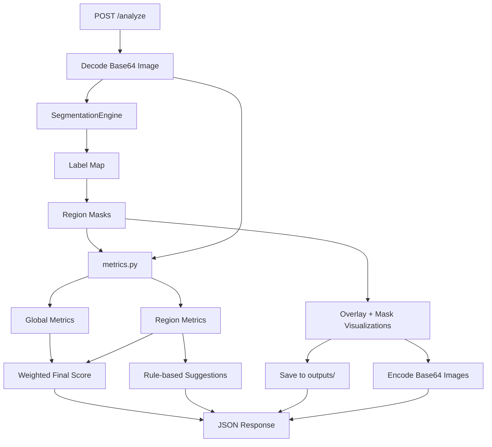

# SegFormer ISP Image Quality Demo

这是一个面向 ISP 调试辅助场景的图像质量分析 demo。

它做的事情不是“给图片打一个总分就结束”，而是先把图像按语义区域和结构区域拆开，再分别计算质量指标，最后输出分数、可视化结果和调参建议。这样比单纯看整图平均值更容易定位问题，也更适合 ISP 调参场景。

## 这个项目能做什么

- 接收 base64 图片
- 用 `SegFormer` 做语义分割
- 把图像划分成 `person`、`sky`、`vegetation`、`background`
- 再按图像结构划分成 `flat`、`edge`、`texture`
- 计算全图和分区质量指标
- 生成最终分数、权重拆解和调参建议
- 返回 overlay、mask、JSON 结果
- 提供 FastAPI 接口和本地前端调试看板

## 为什么这样设计

ISP 调试里一个常见问题是：整张图的平均分数并不能告诉你“到底哪里出了问题”。

比如：

- 天空区域更容易看出噪声和平滑问题
- 人物区域更容易看出锐度和肤色相关问题
- 纹理区域更容易看出细节保留能力

所以这个项目不是只看整图，而是分三层做分析：

1. 全图质量评估
2. 语义区域质量评估
3. 结构区域质量评估

最后再把这些结果合成总分，并输出可解释的建议。

## 整体流程



## 项目结构

```text
cnn_iqa_demo/
├── analyzer.py
├── api.py
├── main.py
├── metrics.py
├── segmentation.py
├── structure_analysis.py
├── static/
├── templates/
├── requirements.txt
├── README.md
├── outputs/
└── tests/
```

各文件职责：

- `segmentation.py`：语义分割、标签映射、mask 和 overlay 生成
- `metrics.py`：清晰度、锐度、亮度噪声、色度噪声等指标计算
- `structure_analysis.py`：`flat / edge / texture` 结构分区
- `analyzer.py`：总编排、加权打分、建议生成
- `api.py`：FastAPI 服务与接口
- `templates/`、`static/`：本地调试看板前端

## 语义分区在做什么

项目使用的模型是：

- `nvidia/segformer-b2-finetuned-ade-512-512`

推理流程大致是：

1. 输入图像先由 OpenCV 解码，原始格式是 `BGR`
2. 转成模型需要的 `RGB`
3. 交给 Hugging Face 的 `processor` 做预处理
4. 用 `SegFormer` 输出语义分割 `logits`
5. 把 `logits` 上采样回原图大小
6. 对类别维度做 `argmax`，得到每个像素的类别
7. 再映射成项目真正关心的 4 类区域

当前区域映射如下：

- `person`: `12`
- `sky`: `2`
- `vegetation`: `4`, `9`, `17`, `66`
- `background`: 上述三类的补集

## 结构分区在做什么

除了语义分区，项目还会基于灰度梯度和局部方差，把图像进一步划分成：

- `flat`
- `edge`
- `texture`

这样做的原因是：

- `flat` 更适合观察噪声
- `edge` 更适合观察锐度
- `texture` 更适合观察细节保留

结构分析结果会输出：

- `structure_metrics`
- `structure_visualizations.overlay_base64`
- `structure_visualizations.mask_base64.flat`
- `structure_visualizations.mask_base64.edge`
- `structure_visualizations.mask_base64.texture`

## 质量指标怎么评估

系统主要用了四类基础指标：

- `Laplacian_Clarity`：Laplacian 方差，表示整体清晰度
- `EdgeGrad_mean`：Sobel 梯度均值，表示边缘锐度
- `sigma_L`：区域灰度标准差，表示亮度噪声
- `sigma_C`：YCrCb 色度通道波动，表示色度噪声

区域得分公式：

```text
score = 0.35 * Laplacian_Clarity_score
      + 0.25 * EdgeGrad_mean_score
      + 0.2 * sigma_L_score
      + 0.2 * sigma_C_score
```

最终得分思路：

```text
base weights = {person: 0.5, sky: 0.2, vegetation: 0.2, global: 0.1}
only valid regions participate in scoring
effective weights are re-normalized across valid regions
```

也就是说：

- 如果某张图里没有 `sky` 或 `person`
- 这些缺失区域不会强行把总分拉成 0
- 系统会对有效区域重新归一化权重

## 安装

```bash
cd ~/Desktop/cnn_iqa_demo
pip install -r requirements.txt
```

首次真实运行语义分割时，会从 Hugging Face 下载预训练权重。

## 启动方式

方式一：

```bash
cd ~/Desktop/cnn_iqa_demo
uvicorn api:app --reload
```

方式二：

```bash
cd ~/Desktop/cnn_iqa_demo
python main.py
```

默认服务地址：

- `http://127.0.0.1:8000`

## 前端调试看板

打开：

- `http://127.0.0.1:8000/`

页面里可以直接上传图片，并查看：

- 语义 overlay
- 结构 overlay
- 各区域 mask
- 最终分数
- 动态权重
- 缺失区域
- 调参建议
- 原始 JSON

## API 概览

当前主要接口有：

- `GET /`：本地调试页面
- `GET /health`：健康检查
- `POST /analyze`：分析单张图片
- `POST /compare`：对比参考图和测试图

## POST /analyze

请求体：

```json
{
  "image": "base64_string"
}
```

支持两种格式：

- 纯 base64
- `data:image/png;base64,...` 形式

返回内容包括：

- `global_metrics`
- `region_metrics`
- `structure_metrics`
- `final_score`
- `effective_weights`
- `score_breakdown`
- `missing_regions`
- `detected_regions`
- `suggestions`
- `visualizations`
- `structure_visualizations`

示例返回：

```json
{
  "request_id": "20260324_abcd1234",
  "global_metrics": {
    "Laplacian_Clarity": 123.4,
    "EdgeGrad_mean": 48.0,
    "sigma_L": 10.2,
    "sigma_C": 6.8,
    "score": 82.1,
    "coverage_ratio": 1.0,
    "valid": true
  },
  "region_metrics": {
    "person": {
      "Laplacian_Clarity": 130.0,
      "EdgeGrad_mean": 51.0,
      "sigma_L": 8.0,
      "sigma_C": 5.4,
      "score": 86.0,
      "coverage_ratio": 0.22,
      "valid": true
    },
    "sky": {},
    "vegetation": {},
    "background": {}
  },
  "structure_metrics": {
    "flat": {},
    "edge": {},
    "texture": {}
  },
  "final_score": 84.3,
  "effective_weights": {
    "person": 0.625,
    "sky": 0.0,
    "vegetation": 0.25,
    "global": 0.125
  },
  "score_breakdown": {
    "person": 53.75,
    "sky": 0.0,
    "vegetation": 18.5,
    "global": 10.26
  },
  "missing_regions": [
    "sky"
  ],
  "detected_regions": [
    {
      "label": "person",
      "coverage_ratio": 0.22,
      "weight": 0.625,
      "metrics": {}
    }
  ],
  "suggestions": [
    "增加锐化",
    "启用亮度降噪"
  ],
  "visualizations": {
    "overlay_base64": "...",
    "mask_base64": {
      "person": "...",
      "sky": "...",
      "vegetation": "...",
      "background": "..."
    },
    "saved_files": {
      "overlay": "outputs/20260324_abcd1234_overlay.png",
      "person": "outputs/20260324_abcd1234_person_mask.png",
      "sky": "outputs/20260324_abcd1234_sky_mask.png",
      "vegetation": "outputs/20260324_abcd1234_vegetation_mask.png",
      "background": "outputs/20260324_abcd1234_background_mask.png"
    }
  },
  "structure_visualizations": {
    "overlay_base64": "...",
    "mask_base64": {
      "flat": "...",
      "edge": "...",
      "texture": "..."
    }
  }
}
```

请求示例：

```bash
curl -X POST http://127.0.0.1:8000/analyze \
  -H "Content-Type: application/json" \
  -d '{"image":"<base64>"}'
```

## POST /compare

这个接口用于对比参考图和测试图。

请求体：

```json
{
  "reference_image": "base64_string",
  "test_image": "base64_string"
}
```

返回结构会包含：

- `reference`
- `test`
- `delta`

适合做 ISP 调参前后效果对比。

## 输出文件和注意事项

- `outputs/` 会自动创建并保存 overlay 与各区域 mask
- API 返回里也会包含这些图片的 base64
- 单元测试默认不会下载真实模型权重
- 分割层测试主要验证类别映射和 mask 生成逻辑
- 当 `person / sky / vegetation` 中某些区域不存在时，这些区域会进入 `missing_regions`

## 快速理解一句话版

这个项目本质上是一个“把 ISP 调试里的看图判断流程拆成可计算步骤”的 demo：先做 SegFormer 语义分区，再做结构分区和质量指标计算，最后输出总分、可视化结果和调参建议。
