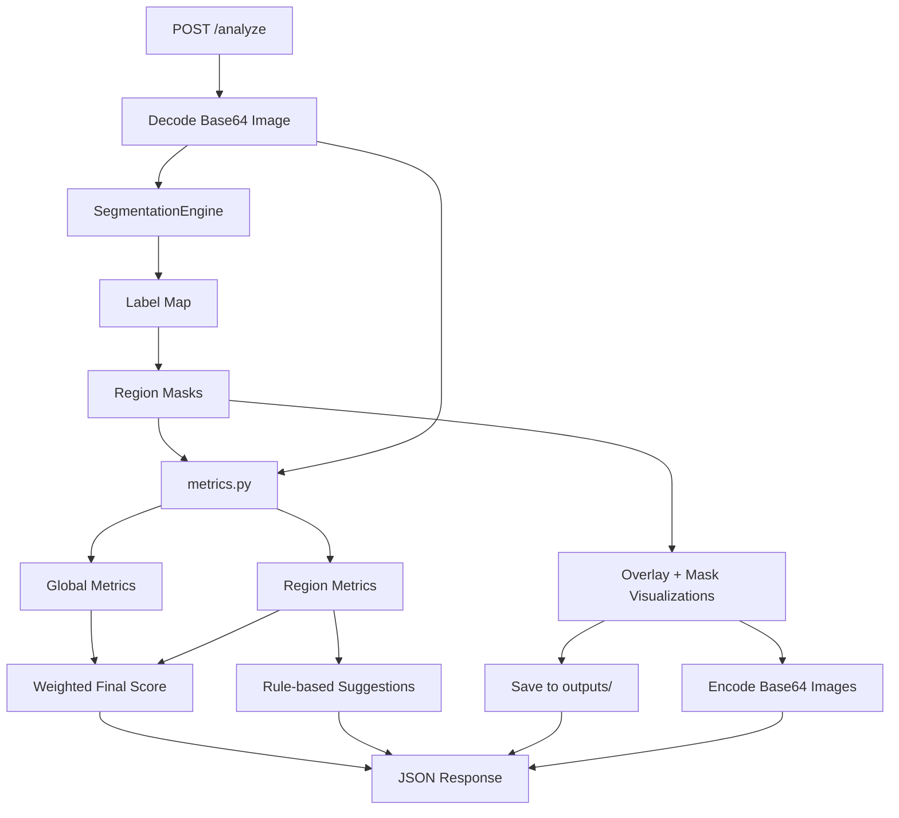

# CNN-Enhanced Image Quality Assessment Demo

一个面向 ISP 调试辅助场景的完整 demo：

- 输入 base64 图片
- 使用 `SegFormer` 做语义分割
- 计算全局和区域级图像质量指标
- 基于梯度 + 局部方差做 `flat / edge / texture` 结构分区
- 输出最终评分与调参建议
- 返回 overlay 和各区域 mask
- 提供 FastAPI 接口

## Project Structure

```text
cnn_iqa_demo/
├── analyzer.py
├── api.py
├── main.py
├── metrics.py
├── segmentation.py
├── structure_analysis.py
├── static/
├── templates/
├── requirements.txt
├── README.md
├── outputs/
└── tests/
```

## Architecture



## Region Mapping

模型使用 `nvidia/segformer-b2-finetuned-ade-512-512`，并将 ADE20K 类别映射为：

- `person`: `12`
- `sky`: `3`
- `vegetation`: `4`, `9`, `17`, `66`
- `background`: 上述三类的补集

## Metrics

- `Laplacian_Clarity`: Laplacian 方差，表示整体清晰度
- `EdgeGrad_mean`: Sobel 梯度均值，表示边缘锐度
- `sigma_L`: 区域灰度标准差，表示亮度噪声
- `sigma_C`: YCrCb 色度通道波动，表示色度噪声

区域得分：

```text
score = 0.35 * Laplacian_Clarity_score
      + 0.25 * EdgeGrad_mean_score
      + 0.2 * sigma_L_score
      + 0.2 * sigma_C_score
```

最终得分：

```text
base weights = {person: 0.5, sky: 0.2, vegetation: 0.2, global: 0.1}
only valid regions participate in scoring
effective weights are re-normalized across valid regions
```

## Structure Analysis

除了语义区域，本项目还会基于灰度梯度和局部方差把整张图划分成：

- `flat`
- `edge`
- `texture`

这部分结果会输出：

- `structure_metrics`
- `structure_visualizations.overlay_base64`
- `structure_visualizations.mask_base64.flat`
- `structure_visualizations.mask_base64.edge`
- `structure_visualizations.mask_base64.texture`

## Install

```bash
cd ~/Desktop/cnn_iqa_demo
pip install -r requirements.txt
```

首次真实运行分割时会下载 Hugging Face 预训练权重。

## Run

方式一：

```bash
cd ~/Desktop/cnn_iqa_demo
uvicorn api:app --reload
```

方式二：

```bash
cd ~/Desktop/cnn_iqa_demo
python main.py
```

服务启动后默认监听 `http://127.0.0.1:8000`。

浏览器调试界面：

- `http://127.0.0.1:8000/`
- 可直接上传图片并查看语义 overlay、结构 overlay、mask、分数、动态权重、缺失区域、建议和原始 JSON

## API

### POST /analyze

Request:

```json
{
  "image": "base64_string"
}
```

支持：

- 纯 base64
- `data:image/png;base64,...` 形式

Response:

```json
{
  "request_id": "20260324_abcd1234",
  "global_metrics": {
    "Laplacian_Clarity": 123.4,
    "EdgeGrad_mean": 48.0,
    "sigma_L": 10.2,
    "sigma_C": 6.8,
    "score": 82.1,
    "coverage_ratio": 1.0,
    "valid": true
  },
  "region_metrics": {
    "person": {
      "Laplacian_Clarity": 130.0,
      "EdgeGrad_mean": 51.0,
      "sigma_L": 8.0,
      "sigma_C": 5.4,
      "score": 86.0,
      "coverage_ratio": 0.22,
      "valid": true
    },
    "sky": {},
    "vegetation": {},
    "background": {}
  },
  "structure_metrics": {
    "flat": {},
    "edge": {},
    "texture": {}
  },
  "final_score": 84.3,
  "effective_weights": {
    "person": 0.625,
    "sky": 0.0,
    "vegetation": 0.25,
    "global": 0.125
  },
  "score_breakdown": {
    "person": 53.75,
    "sky": 0.0,
    "vegetation": 18.5,
    "global": 10.26
  },
  "missing_regions": [
    "sky"
  ],
  "detected_regions": [
    {
      "label": "person",
      "coverage_ratio": 0.22,
      "weight": 0.625,
      "metrics": {}
    }
  ],
  "suggestions": [
    "increase sharpening",
    "apply denoising"
  ],
  "visualizations": {
    "overlay_base64": "...",
    "mask_base64": {
      "person": "...",
      "sky": "...",
      "vegetation": "...",
      "background": "..."
    },
    "saved_files": {
      "overlay": "outputs/20260324_abcd1234_overlay.png",
      "person": "outputs/20260324_abcd1234_person_mask.png",
      "sky": "outputs/20260324_abcd1234_sky_mask.png",
      "vegetation": "outputs/20260324_abcd1234_vegetation_mask.png",
      "background": "outputs/20260324_abcd1234_background_mask.png"
    }
  },
  "structure_visualizations": {
    "overlay_base64": "...",
    "mask_base64": {
      "flat": "...",
      "edge": "...",
      "texture": "..."
    }
  }
}
```

## Example Request

```bash
curl -X POST http://127.0.0.1:8000/analyze \
  -H "Content-Type: application/json" \
  -d '{"image":"<base64>"}'
```

## Notes

- `outputs/` 会自动创建并保存 overlay 与各区域 mask。
- API 返回也会包含这些图片的 base64。
- 单元测试默认不下载真实模型权重；分割层测试只验证类别映射和 mask 生成逻辑。
- 当 `person / sky / vegetation` 中某些区域不存在时，它们会出现在 `missing_regions` 中，但不会再把 `final_score` 强行拉成 0。
